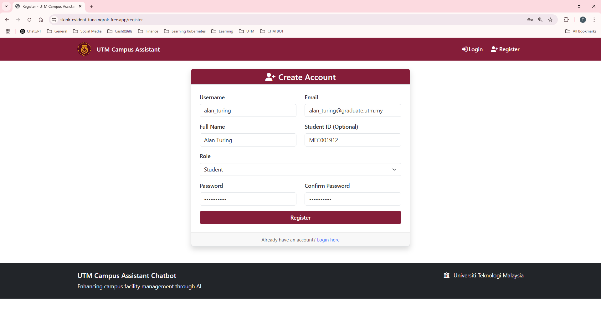
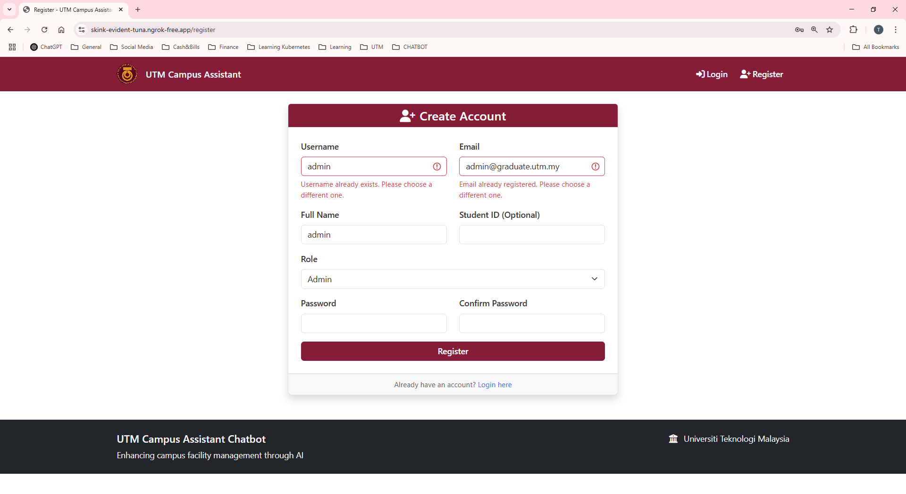
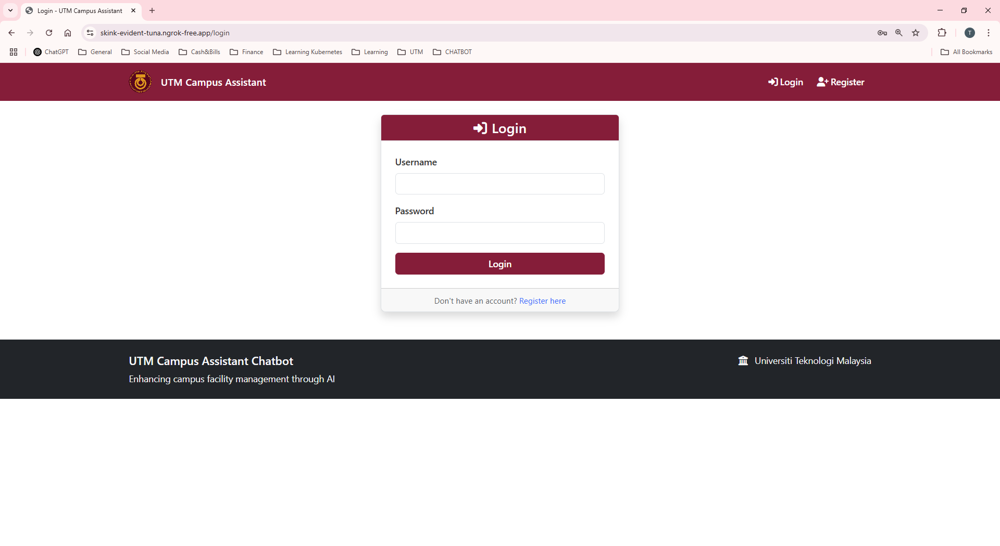

User Management
===============

This section covers comprehensive user account management, authentication, and role administration.

User Account System
-------------------

Account Types and Roles
~~~~~~~~~~~~~~~~~~~~~~~

**Student Accounts**:

- Primary user type for facility services
- Access to issue reporting and facility booking
- Limited to own data and general system features
- Require institutional email for verification

**Administrator Accounts**:

- Full system access and management capabilities
- Issue management and facility administration
- User oversight and system configuration
- Analytics and reporting access

User Registration Process
~~~~~~~~~~~~~~~~~~~~~~~~

**Student Registration**:

1. **Required Information**:
   
   - Username (4-20 characters, unique)
   - Email address (institutional preferred)
   - Full name (2-100 characters)
   - Student ID (optional, up to 20 characters)
   - Secure password (minimum 6 characters)

2. **Validation Process**:
   
   .. image:: ../screenshots/Student_Register_Failed.PNG
      :alt: Registration Validation Errors
      :align: center
      :width: 600px
   
   - Username uniqueness check
   - Email format and uniqueness validation
   - Student ID uniqueness verification
   - Password strength requirements
   - Form completion validation

**Admin Registration**:

1. **Restricted Registration**:
   
   - Admin role selection available during registration
   - Enhanced security validation
   - Manual verification may be required
   - Institutional email verification

2. **Admin Privileges Assignment**:
   
   - System-wide administrative access
   - User management capabilities
   - Facility and booking management
   - System configuration rights

Authentication and Security
--------------------------

Login System
~~~~~~~~~~~

**Authentication Features**:

- Username/password authentication
- Bcrypt password hashing with salt
- Session-based login persistence
- Automatic session timeout
- CSRF protection on all forms

**Security Measures**:

.. code-block:: python

   # Password Security Implementation
   from flask_bcrypt import Bcrypt
   
   # Password hashing during registration
   password_hash = bcrypt.generate_password_hash(password)
   
   # Password verification during login
   bcrypt.check_password_hash(user.password_hash, password)

Session Management
~~~~~~~~~~~~~~~~~

**Session Configuration**:

.. list-table:: Session Settings
   :header-rows: 1
   :widths: 30 50 20

   * - Setting
     - Description
     - Default Value
   * - **Session Timeout**
     - Automatic logout after inactivity
     - 24 hours
   * - **Remember Me**
     - Extended session duration
     - 7 days
   * - **Secure Cookies**
     - HTTPS-only cookie transmission
     - Enabled
   * - **Session Secret**
     - Encryption key for session data
     - Environment variable

**Session Lifecycle**:

1. **Login**: Create encrypted session with user ID
2. **Activity**: Extend session on each request
3. **Timeout**: Automatic logout after inactivity
4. **Logout**: Clear session data and cookies

User Profile Management
----------------------

Student Profile Features
~~~~~~~~~~~~~~~~~~~~~~~

**Profile Information**:

- Personal details (name, email, student ID)
- Account creation date and last login
- Activity summary (issues, bookings, chat history)
- Preference settings (notifications, display options)

**Self-Service Options**:

- Update contact information
- Change password
- View account activity history
- Download personal data (GDPR compliance)

Admin Profile Features
~~~~~~~~~~~~~~~~~~~~

**Extended Profile Access**:

- Administrative privileges summary
- System access logs and audit trail
- Performance metrics and activity statistics
- Advanced preference settings

**Administrative Capabilities**:

- User account oversight
- System configuration access
- Advanced reporting features
- Security monitoring tools

User Activity Monitoring
------------------------

Activity Tracking
~~~~~~~~~~~~~~~~

**Student Activity Metrics**:

.. list-table:: Student Activity Tracking
   :header-rows: 1
   :widths: 25 50 25

   * - Activity Type
     - Description
     - Retention Period
   * - **Login Events**
     - Login/logout timestamps
     - 90 days
   * - **Issue Reports**
     - Facility issues submitted
     - Permanent
   * - **Booking Requests**
     - Facility booking history
     - 2 years
   * - **Chat Sessions**
     - AI chatbot interactions
     - 30 days
   * - **Facility Views**
     - Facility information accessed
     - 7 days

**Admin Activity Logging**:

.. list-table:: Administrative Action Logging
   :header-rows: 1
   :widths: 25 50 25

   * - Action Type
     - Description
     - Retention Period
   * - **User Management**
     - Account creation/modification
     - Permanent
   * - **Issue Actions**
     - Status updates, assignments
     - Permanent
   * - **Booking Decisions**
     - Approval/rejection actions
     - Permanent
   * - **System Changes**
     - Configuration modifications
     - Permanent
   * - **Data Access**
     - Report generation, data exports
     - 1 year

Behavioral Analytics
~~~~~~~~~~~~~~~~~~

**Usage Patterns**:

- Peak usage times and seasons
- Most popular facilities and services
- Common issue types and locations
- Chatbot query patterns and success rates

**Performance Indicators**:

- User engagement metrics
- Feature adoption rates
- Support request volume
- User satisfaction scores

Account Administration
---------------------

User Account Management
~~~~~~~~~~~~~~~~~~~~~~

**Account Status Management**:

.. code-block:: python

   # Account Status Options
   class AccountStatus:
       ACTIVE = "active"       # Normal account access
       SUSPENDED = "suspended" # Temporary access restriction
       INACTIVE = "inactive"   # Account deactivated
       PENDING = "pending"     # Awaiting verification

**Administrative Actions**:

1. **Account Activation/Deactivation**:
   
   - Suspend problematic accounts
   - Reactivate suspended accounts
   - Permanent account deletion (GDPR compliance)
   - Bulk account management tools

2. **Role Management**:
   
   - Promote students to admin status
   - Revoke administrative privileges
   - Create specialized admin roles
   - Permission matrix management

3. **Account Verification**:
   
   - Verify student ID authenticity
   - Confirm institutional email addresses
   - Manual account approval process
   - Batch verification tools

Data Management and Privacy
~~~~~~~~~~~~~~~~~~~~~~~~~~

**Personal Data Handling**:

- Secure storage of user information
- Encryption of sensitive data
- Regular data backup procedures
- GDPR compliance measures

**Data Retention Policies**:

.. list-table:: Data Retention Schedule
   :header-rows: 1
   :widths: 30 40 30

   * - Data Type
     - Retention Period
     - Deletion Method
   * - **User Profiles**
     - Account lifetime + 1 year
     - Secure deletion
   * - **Authentication Logs**
     - 90 days
     - Automatic purging
   * - **Activity History**
     - Varies by type
     - Policy-based cleanup
   * - **Chat Conversations**
     - 30 days
     - Automatic deletion
   * - **Issue Reports**
     - Permanent (anonymized)
     - Identity removal

Bulk Operations
--------------

User Import/Export
~~~~~~~~~~~~~~~~~

**Bulk User Import**:

.. code-block:: csv

   # CSV Import Format
   username,email,full_name,student_id,role
   john_doe,john@utm.edu.my,John Doe,12345,student
   admin_user,admin@utm.edu.my,Administrator,,admin

**Data Export Options**:

- User directory export
- Activity reports
- Compliance reports (GDPR)
- Statistical summaries

**Batch Operations**:

- Password reset for multiple users
- Role changes for user groups
- Account status updates
- Notification broadcasting

Integration with External Systems
---------------------------------

LDAP/Active Directory Integration
~~~~~~~~~~~~~~~~~~~~~~~~~~~~~~~

**Directory Service Configuration**:

.. code-block:: python

   # LDAP Integration (Future Enhancement)
   LDAP_CONFIG = {
       'server': 'ldap://directory.utm.edu.my',
       'base_dn': 'ou=users,dc=utm,dc=edu,dc=my',
       'user_filter': '(uid=%s)',
       'attributes': ['uid', 'mail', 'displayName', 'studentId']
   }

**Benefits of Integration**:

- Single sign-on (SSO) capability
- Automatic user provisioning
- Centralized authentication
- Reduced password management overhead

Student Information System Integration
~~~~~~~~~~~~~~~~~~~~~~~~~~~~~~~~~~~~

**SIS Data Synchronization**:

- Automatic student enrollment updates
- Academic status verification
- Course enrollment validation
- Graduation status tracking

**Data Synchronization Schedule**:

- Daily incremental updates
- Weekly full synchronization
- Real-time critical updates
- Semester rollover procedures

Compliance and Auditing
-----------------------

Audit Trail Management
~~~~~~~~~~~~~~~~~~~~

**Comprehensive Logging**:

.. code-block:: python

   # Audit Log Entry Structure
   audit_log = {
       'timestamp': datetime.utcnow(),
       'user_id': current_user.id,
       'action': 'user_login',
       'target': 'system',
       'details': {'ip_address': request.remote_addr},
       'result': 'success'
   }

**Audit Categories**:

- Authentication events
- Authorization changes
- Data access and modifications
- Administrative actions
- System configuration changes

Compliance Reporting
~~~~~~~~~~~~~~~~~~~

**Regulatory Compliance**:

- GDPR data processing reports
- Access control compliance audits
- Data retention policy adherence
- Security incident documentation

**Report Generation**:

- Monthly access reports
- Quarterly security reviews
- Annual compliance assessments
- Ad-hoc investigation reports

Privacy and Data Protection
~~~~~~~~~~~~~~~~~~~~~~~~~~

**Privacy Features**:

- Data anonymization for analytics
- Consent management for data processing
- Right to deletion (GDPR Article 17)
- Data portability (GDPR Article 20)

**Protection Measures**:

- Encryption at rest and in transit
- Access control and authentication
- Regular security assessments
- Incident response procedures

Troubleshooting User Issues
--------------------------

Common User Problems
~~~~~~~~~~~~~~~~~~

**Login Issues**:

1. **Forgotten Password**:
   
   - Password reset functionality
   - Email verification process
   - Administrative password override

2. **Account Lockout**:
   
   - Failed login attempt limits
   - Automatic unlock procedures
   - Manual admin intervention

3. **Registration Problems**:
   
   - Duplicate account prevention
   - Email verification issues
   - Student ID validation errors

**Resolution Procedures**:

.. code-block:: text

   Problem Resolution Workflow:
   1. Identify issue type and scope
   2. Check system logs for error details
   3. Apply appropriate resolution method
   4. Verify fix with user testing
   5. Document solution for future reference

Advanced User Management
-----------------------

Custom User Fields
~~~~~~~~~~~~~~~~~

**Extensible Profile System**:

- Custom profile fields for specific needs
- Department/faculty associations
- Academic year and program tracking
- Emergency contact information

**Configuration Management**:

.. code-block:: python

   # Custom Field Configuration
   CUSTOM_FIELDS = {
       'department': {
           'type': 'select',
           'options': ['Engineering', 'Science', 'Business'],
           'required': False
       },
       'academic_year': {
           'type': 'integer',
           'range': [1, 4],
           'required': True
       }
   }

Notification Management
~~~~~~~~~~~~~~~~~~~~~~

**User Notification Preferences**:

- Email notification settings
- In-app notification controls
- Mobile push notification options
- Notification frequency management

**Notification Categories**:

- Issue status updates
- Booking confirmations
- System announcements
- Security alerts