# UTM Campus Assistant Chatbot - User Guide

## Table of Contents
1. [Getting Started](#getting-started)
2. [Using the AI Chatbot](#using-the-ai-chatbot)
3. [Reporting Facility Issues](#reporting-facility-issues)
4. [Finding Facility Information](#finding-facility-information)
5. [Booking Facilities](#booking-facilities)

---

## Getting Started

The UTM Campus Assistant Chatbot helps you manage all your campus facility needs in one place. You can report problems, book facilities, get directions, and ask questions using our smart AI assistant.

### Creating Your Account


1. **Sign Up**: Click "Register" on the login page
2. **Fill Your Details**:
   - Username (4-20 characters)
   - Your UTM email address
   - Full name
   - Student ID (optional)
   - Secure password (minimum 6 characters)
3. **Select Role**: Choose "Student" from the dropdown
4. **Submit**: Complete registration and login

### Your Dashboard


After logging in, your dashboard shows:
- **Quick Stats**: Your active issues and bookings
- **Recent Activity**: Latest updates on your requests
- **Quick Actions**: Fast access to common tasks
- **AI Chat**: Direct access to the smart assistant

### Navigation Menu

The main menu gives you access to:
- **Dashboard**: Your personal overview
- **Chatbot**: AI assistant for questions
- **Facilities**: Browse and book campus facilities
- **Report Issue**: Submit facility problems
- **My Issues**: Track your reported problems
- **My Bookings**: View your facility reservations

---

## Using the AI Chatbot

The AI chatbot is your smart assistant that understands natural language and can help with facility-related questions.

### Starting a Conversation

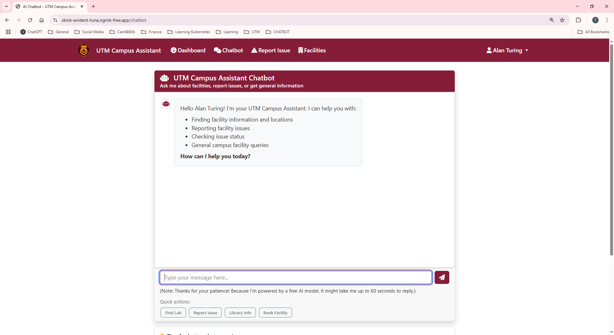

1. **Access Chat**: Click "Chatbot" in the main menu
2. **Type Naturally**: Ask questions in plain English
3. **Get Responses**: The AI provides helpful information and suggestions

### What You Can Ask

**Facility Information**:
- "Where is the main library?"
- "What time does the gym close?"
- "How many people can fit in Lecture Hall A?"

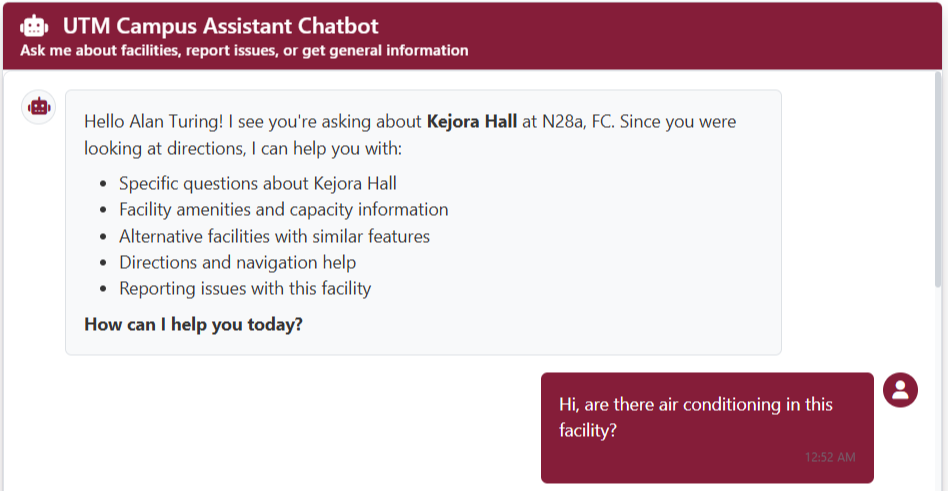

**Getting Directions**:
- "How do I get to the engineering lab?"
- "Where is the nearest parking to Block C?"
- "Can you give me directions to the cafeteria?"

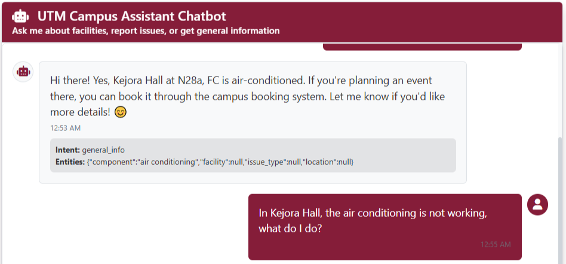

**Booking Help**:
- "Can I book the computer lab tomorrow?"
- "What facilities are available for group study?"
- "How do I reserve a meeting room?"

**General Campus Questions**:
- "What dining options are available?"
- "Where can I print documents?"
- "What sports facilities do we have?"

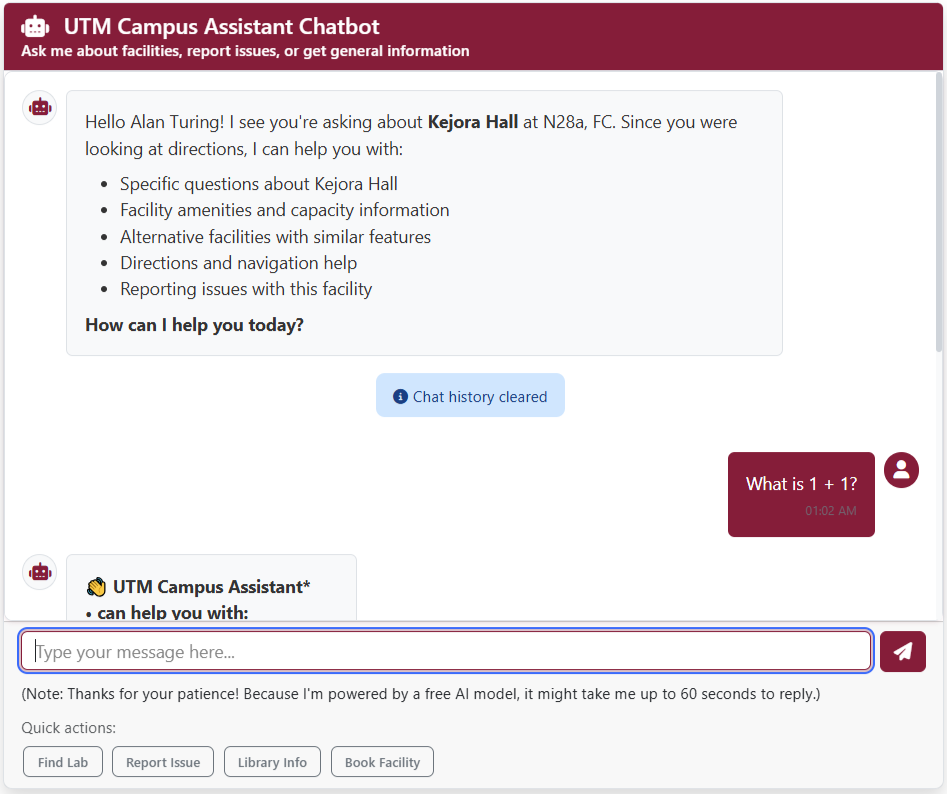

### Chat Features

**Clear Chat**: Use the "Clear Chat" button to start fresh conversations

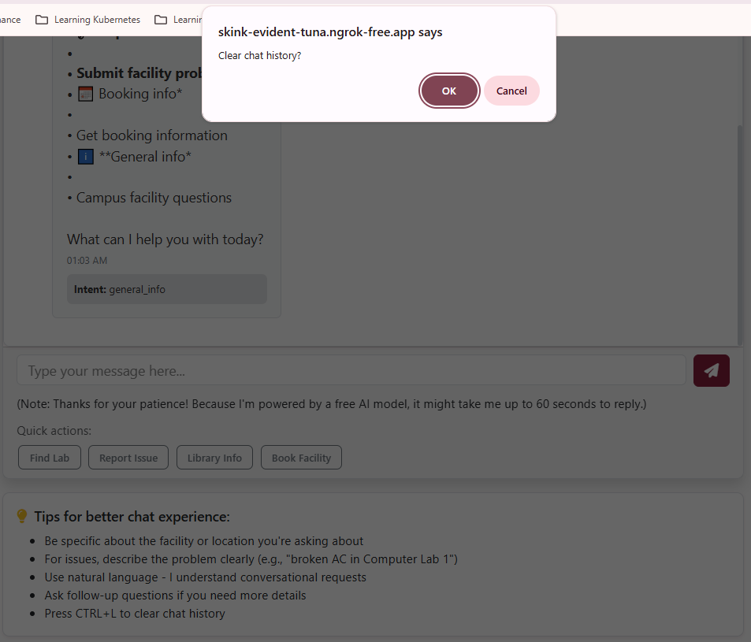

**Smart Responses**: The AI remembers your conversation context and provides relevant follow-up suggestions

**Helpful Links**: The AI can direct you to specific pages for booking or reporting issues

---

## Reporting Facility Issues

When you notice problems with campus facilities, you can easily report them for quick resolution.

### How to Report Issues

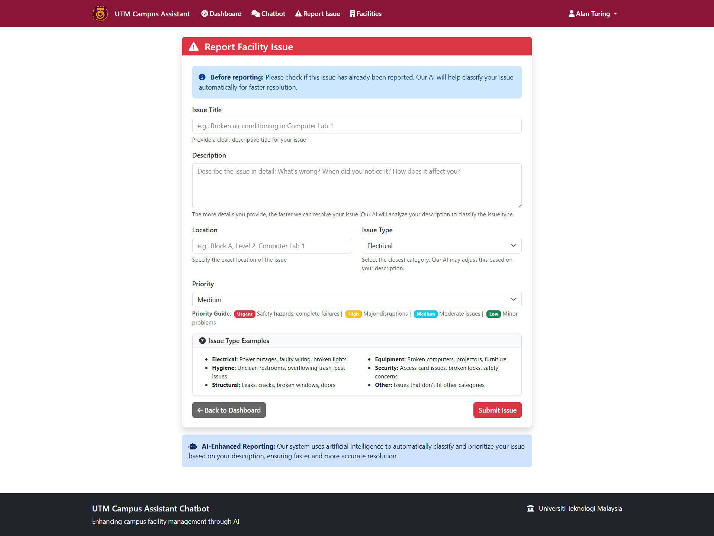

1. **Access Form**: Click "Report Issue" or ask the chatbot
2. **Fill Details**:
   - **Title**: Brief description of the problem
   - **Description**: Detailed explanation (minimum 10 characters)
   - **Issue Type**: Select category (electrical, hygiene, structural, equipment, security, other)
   - **Priority**: Choose urgency level
   - **Location**: Specify where the problem is

3. **Submit**: Your report goes directly to administrators

### Issue Categories

| Type | Examples |
|------|----------|
| **Electrical** | Broken lights, power outlets not working, electrical hazards |
| **Hygiene** | Dirty restrooms, overflowing trash, cleaning needed |
| **Structural** | Broken doors, leaky roofs, damaged walls |
| **Equipment** | Broken projectors, faulty computers, lab equipment issues |
| **Security** | Broken locks, access card problems, safety concerns |
| **Other** | General maintenance, air conditioning, other problems |

### Tracking Your Issues

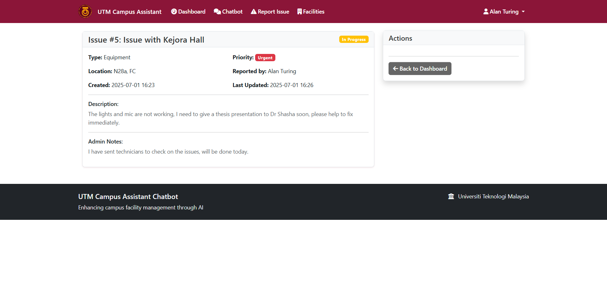

You can track your reported issues:
- **Status Updates**: See progress from "Reported" to "Resolved"
- **Admin Notes**: Read updates from maintenance staff
- **Resolution Timeline**: Know when issues are fixed
- **Feedback Option**: Rate the resolution quality

### Issue Lifecycle

Your reported issues follow this process:
```
Your Report → Admin Review → In Progress → Resolved → Closed
```

You'll receive updates at each stage and can provide feedback when issues are resolved.

---

## Finding Facility Information

The system helps you discover and learn about all campus facilities.

### Browsing Facilities

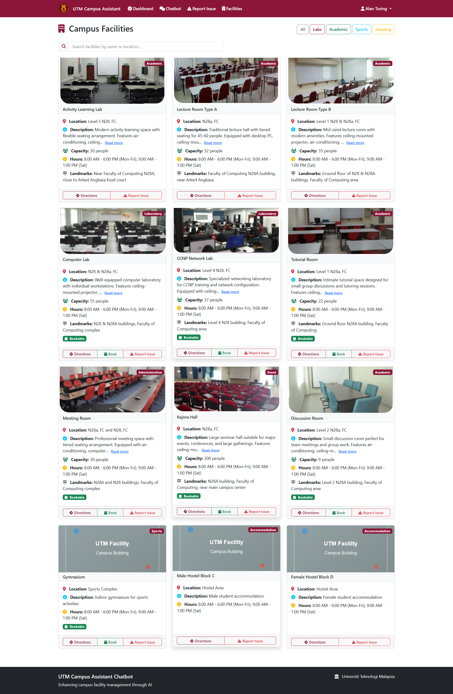

1. **View All**: Access "Facilities" from the main menu
2. **Filter Options**: Use filters to find specific types
3. **Search**: Look for facilities by name or location

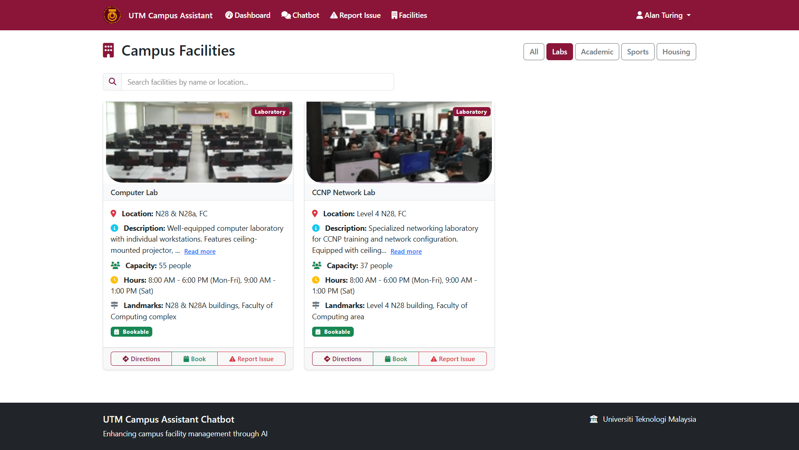

### Facility Categories

- **Academic**: Classrooms, lecture halls, libraries
- **Laboratory**: Research labs, computer labs, teaching labs
- **Sports**: Gyms, fields, courts, fitness centers
- **Administrative**: Offices, meeting rooms
- **Dining**: Cafeterias, food courts, coffee shops
- **Event**: Auditoriums, conference rooms

### Getting Detailed Information

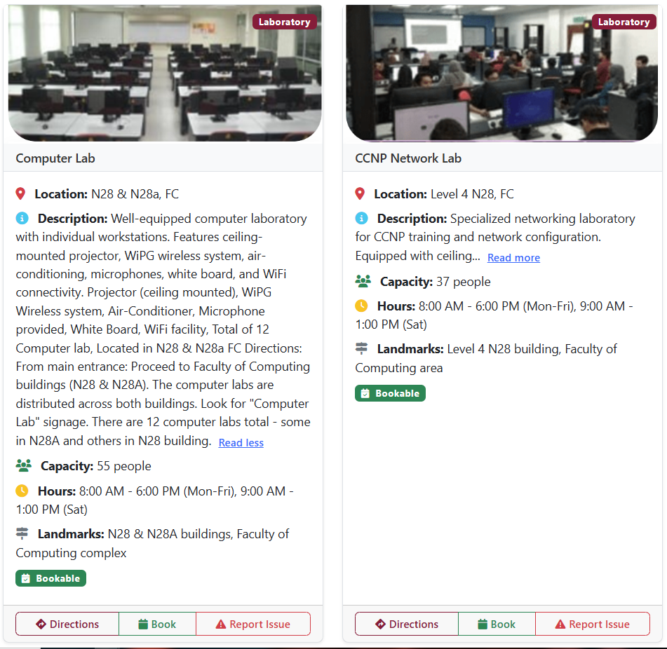

For each facility, you can see:
- **Location**: Detailed address and building information
- **Operating Hours**: When the facility is open
- **Capacity**: How many people it can accommodate
- **Equipment**: Available resources and tools
- **Contact Info**: Who to contact for more information
- **Booking Status**: Whether you can reserve it

### Getting Directions

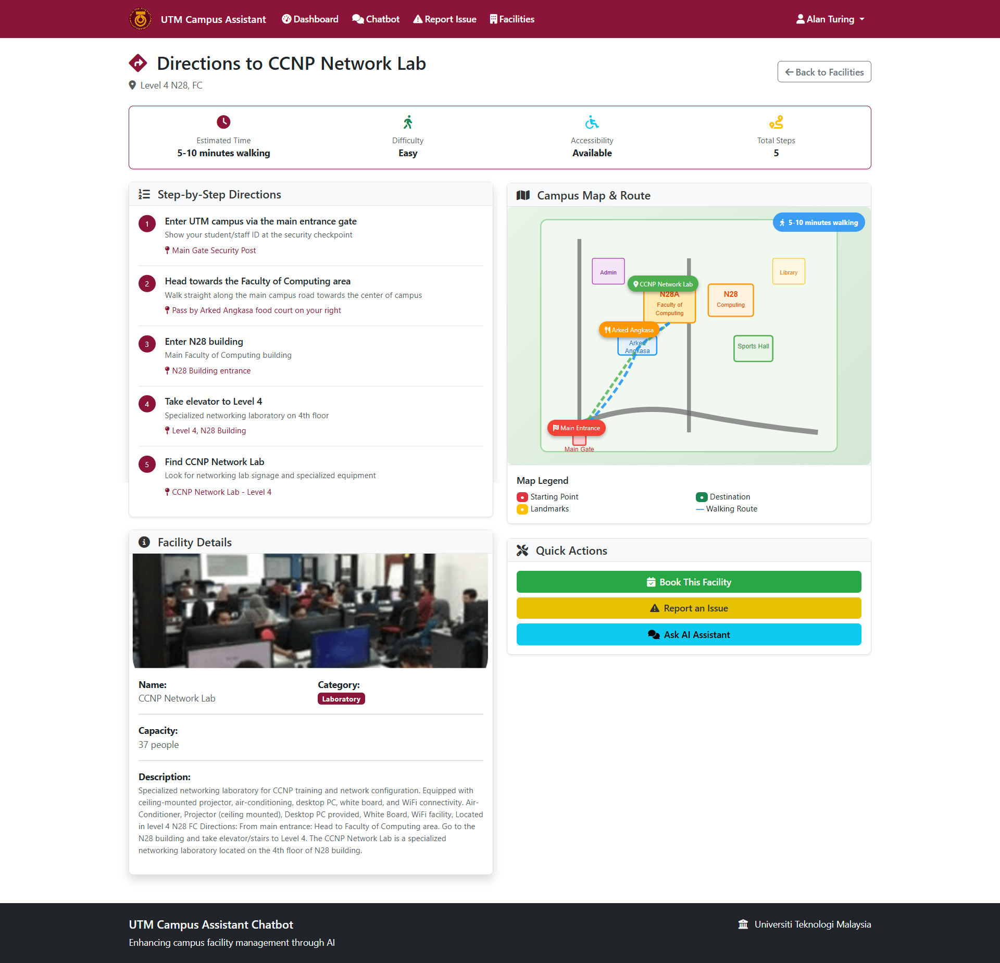

1. **Click Directions**: Use the "Get Directions" button
2. **Step-by-Step**: Follow detailed walking directions
3. **Landmarks**: Use campus landmarks for navigation
4. **Map Reference**: Visual route information

### Ask the AI

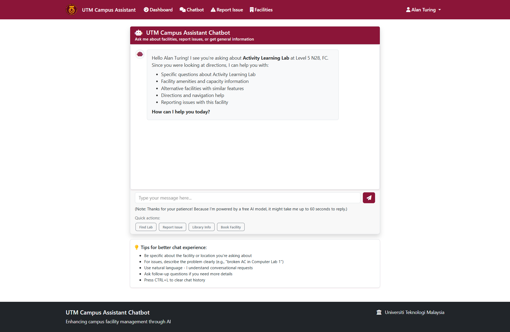

Use the "Ask AI" feature on any facility page to get instant answers about:
- Specific equipment or services
- Best times to visit
- Alternative similar facilities
- Booking procedures

---

## Booking Facilities

Reserve campus facilities for your academic and personal activities.

### How to Book Facilities

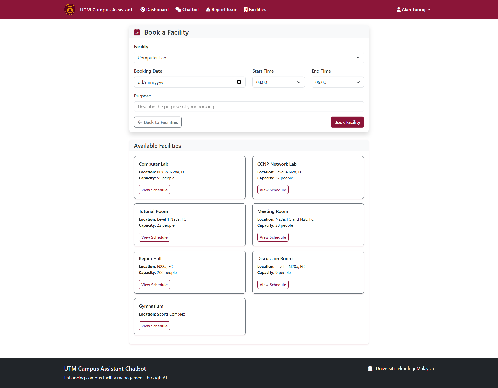

1. **Choose Facility**: Select from bookable facilities
2. **Pick Date**: Choose your preferred date
3. **Select Time**: Pick start and end hours
4. **State Purpose**: Explain why you need the facility
5. **Submit Request**: Send for admin approval

### Booking Requirements

- **Valid Account**: Must be registered student
- **Advance Notice**: Book at least 24 hours ahead
- **Reasonable Duration**: Most bookings limited to 2-4 hours
- **Clear Purpose**: Explain intended use
- **Academic Priority**: Educational activities get preference

### Checking Availability

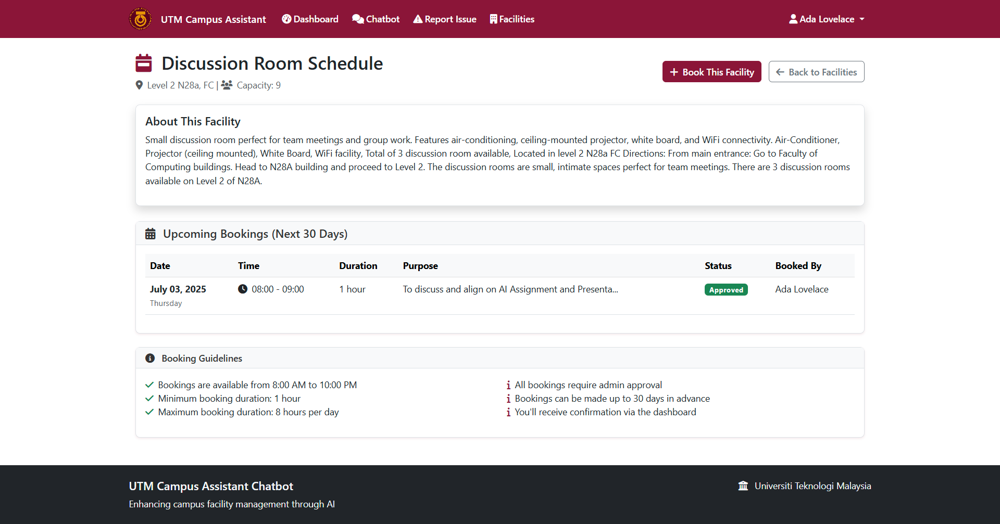

**View Schedules**: Check facility calendars to see:
- Available time slots
- Existing bookings
- Popular times
- Alternative dates

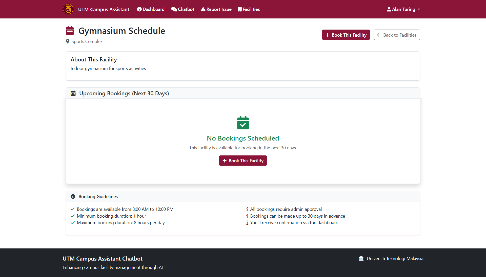

### Booking Status

Your requests will show one of these statuses:
- **Pending**: Waiting for admin review
- **Approved**: Booking confirmed
- **Rejected**: Request denied (with reason)
- **Cancelled**: You cancelled the booking

### Managing Your Bookings

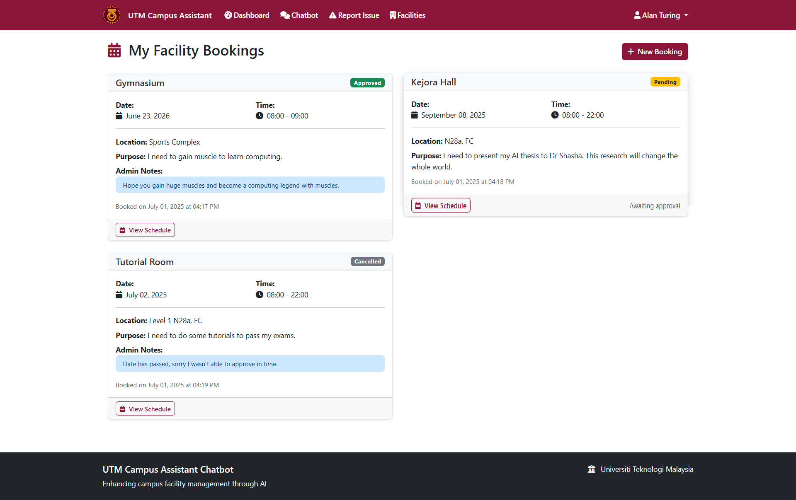

In "My Bookings" you can:
- **View All**: See all your current and past bookings
- **Check Status**: Monitor approval status
- **Cancel**: Cancel future bookings if needed
- **Reschedule**: Contact admin for changes

### Booking Tips

**Increase Approval Chances**:
- Book during off-peak hours
- Provide clear, academic purposes
- Choose appropriate facility size
- Give advance notice
- Be flexible with times

**Popular Booking Times** (higher competition):
- Monday-Friday 10 AM - 4 PM
- Study period before exams
- Group project season

**Best Booking Times** (easier approval):
- Early morning (8-10 AM)
- Late afternoon (4-6 PM)
- Weekends
- Evening hours

---

## Quick Tips and Best Practices

### Using the System Effectively

**Chatbot Tips**:
- Ask specific questions for better answers
- Use facility names mentioned in the system
- Be clear about what information you need
- Try different ways of asking if you don't get the right answer

**Issue Reporting Tips**:
- Be specific about the location
- Include details about the problem
- Choose the right category for faster response
- Check if someone already reported the same issue

**Booking Tips**:
- Plan ahead - don't wait until the last minute
- Have backup options ready
- Check facility schedules before requesting
- Be flexible with times to increase approval chances

### Common Questions

**Q: How long does it take to get issue responses?**
A: Urgent issues (electrical, security) get attention within 2-4 hours. Other issues are typically addressed within 24-48 hours.

**Q: Why was my booking rejected?**
A: Common reasons include facility conflicts, inappropriate use, or high demand. Check the admin notes for specific reasons and suggestions.

**Q: Can I modify my booking after submission?**
A: Contact administrators through the system or visit the admin office. Some changes may be possible before approval.

**Q: How do I cancel a booking?**
A: Use the "My Bookings" page to cancel future reservations. Cancelled bookings free up slots for other students.

**Q: What if the chatbot doesn't understand my question?**
A: Try rephrasing your question, use specific facility names, or report the issue to help improve the system.

### Getting Help

**Technical Issues**:
- Try refreshing the page
- Clear your browser cache
- Log out and log back in
- Contact IT support if problems persist

**Account Problems**:
- Use the "Forgot Password" link if you can't login
- Contact the admin office for account issues
- Make sure you're using your correct UTM email

**Facility Questions**:
- Use the AI chatbot for instant answers
- Check the detailed facility information pages
- Contact facility managers directly using provided contact info

---

## Quick Reference

### Key Features Summary
- **AI Chatbot**: Get instant answers about facilities and campus
- **Issue Reporting**: Report facility problems for quick resolution
- **Facility Information**: Find locations, hours, and equipment details
- **Booking System**: Reserve facilities for your activities
- **Real-time Updates**: Track your issues and bookings

### Important Links
- **Login**: Main application page
- **Dashboard**: Your personal overview after login
- **Chatbot**: AI assistant for questions
- **Facilities**: Browse all campus facilities
- **Report Issue**: Submit facility problems
- **My Bookings**: Manage your reservations

### Contact Information
- **Technical Support**: Contact IT help desk
- **Facility Issues**: Use the issue reporting system
- **Booking Questions**: Contact facility administrators
- **Account Problems**: Visit student services office

---

*This user guide covers all the main features of the UTM Campus Assistant Chatbot. The system is designed to make your campus experience smoother and more efficient. For technical documentation, administrators can refer to the detailed admin manual.*